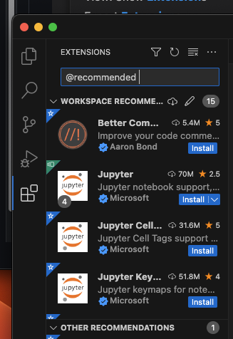
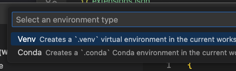

# 2. Visual Studio Code (aka vscode)

Other than vscode itself, we have installed Python and Git. Now we want to fine tune vscode to make it more suitable for Python development with Git. To be more precise, we are building a proper **workspace** for our need.

For moment, a workspace for us apply to a single project, which is a single repository (meaning a single folder). We will see later that a workspace can be a collection of folders.

## 2.1 Extensions   


Put the following to `.vscode/extensions.json`

```
"recommendations": [
		"aaron-bond.better-comments",
		"ms-toolsai.jupyter",
		"ms-toolsai.vscode-jupyter-cell-tags",
		"ms-toolsai.jupyter-keymap",
		"ms-toolsai.vscode-jupyter-slideshow",
		"yzhang.markdown-all-in-one",
		"shd101wyy.markdown-preview-enhanced",
		"goessner.mdmath",
		"ms-python.python",
		"natqe.reload",
		"ms-ceintl.vscode-language-pack-zh-hant",
		"formulahendry.code-runner",
		"github.copilot",
		"eamodio.gitlens",
		"github.vscode-pull-request-github"
	],
```

Show recommended extensions by typing `@recommended` in the search box.



Then click install one-by-one.

## 2.2 Create Python environment





Once you create a Python environment, you also want to create the corresponding Python terminal.


